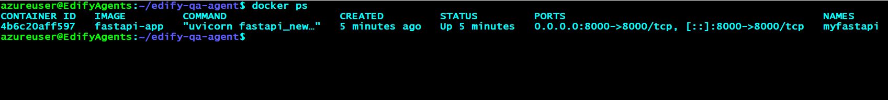
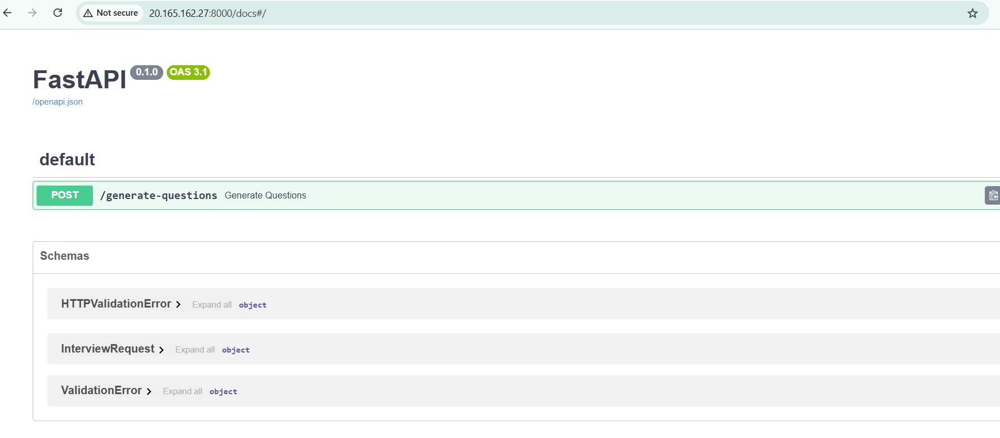

# edify-qa-agent
myportal questions and answers generation agent

## Docker Build & Run Commands
1. Build the Docker image

''' docker build -t fastapi-app . '''
2. Run the Docker container
'''
docker run -d -p 8000:8000 --name myfastapi fastapi-app
'''

3. Browse app
- pub-ip:8000/docs
